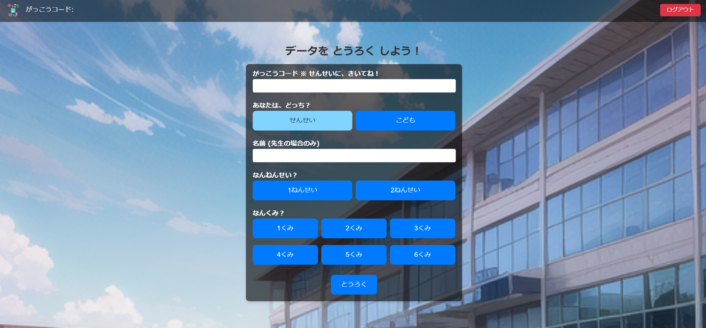
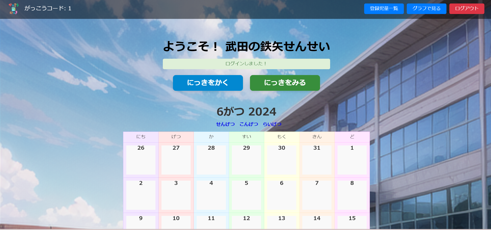

# がっこうにっき

## サービスURL

https://school-diary.xyz/

 

## 開発のきっかけ

&ensp;教育現場では、以下の【1】で示すような現状と課題を抱えています。それに対して、自分なりの仮説を【2】のように立てました。

### 【1】 現状と課題

- 小学校では低学年から一人一台タブレットが配布されるようになってきた(東京)が、「低学年にはまだ難しいから」という理由で、なかなか活用されない現状がある。

- 低学年の担任となる教員の中には、タブレット端末の操作に苦手意識をもっている傾向が強い教員もいて、低学年の児童がタブレットを活用する機会がますます減っている。

### 【2】 仮説

- 小学校1,2年生でも扱えるような操作性と、扱っても問題のない安全性を両立させたアプリを作れば、低学年のうちから「タブレットを使う」ことに慣れ、学年が上がるにつれて、子供たちがますますICT機器を活用できるようになるのではないか。

- ICT機器の操作に苦手意識のある教員でも使いやすいアプリを作れば、使う機会が増えるのではないか。

### 【3】 目標

&ensp;このアプリをきっかけに、小学校低学年のタブレット活用を促進するとともに、最終的に次の目標を達成したいと考えました。

#### (1) 子供の成長と自己表現
&ensp; 小学校低学年の子供たちが、日々の学校生活を通じて成長し、自己表現や感情の表現を身につけることを支援すること。

#### (2) 学校と家庭のコミュニケーション促進
&ensp; 子供たちの日記を通じて、学校と家庭の間でコミュニケーションを促進し、子供たちの学習状況や感情面の理解を深めること。

#### (3) 個別最適な学びの実現
&ensp; 教師が児童の学習進捗や感情面を把握し、個別のニーズに応じた教育アプローチを実現すること。

 

## 機能一覧

## ⚪︎ 機能一覧

| トップ画面                                 　　 |
| -----------------------------------------------|
|  　　　　　　　　　 |
| ログインでは、Googleアカウントで認証を行います。 今回対象としているユーザーに配布されたタブレット端末が、Chromebookであることを想定して設計したためです。   |

| 追加情報登録画面(先生)                                  | 追加情報登録画面(子供)                  |
| ------------------------------------------------------| --------------------------------------|
|  |  |
| 「がっこうコード」により、複数の学校でこのアプリを登録することが可能となります。 「せんせい」を選んだ場合は、名前を登録します。                                    | 「こども」を選んだ場合、名前などは登録せずに、全て「学年」「クラス」「出席番号」で管理します。 また、この画面は初回ログイン時のみ返され、次回以降はすぐにログイン後の画面へ遷移します。 |

| ログイン後画面(先生)                                    | ログイン後画面(子供)                  |
| ------------------------------------------------------| --------------------------------------|
|  |  |
| 「せんせい」の場合、登録した名前が表示されます。           | 「こども」の場合、「学年」「クラス」「出席番号」が表示されます。 |

### 共通機能
&ensp;アプリの使い方などを先生が教室で子供たちに説明する場面を想定して、「せんせい」画面にも、「こども」と同様の機能をもたせてあります。

| にっきをかく画面                                       | カレンダー&スタンプ画面                  |
| ------------------------------------------------------| --------------------------------------|
|   |  |
| 4つの質問に対して、表情スタンプで回答します。   | 「ていしゅつ」を押すと、カレンダーにスタンプが表示されます。      |

| にっきをよむ画面                               　　 |
| -----------------------------------------------|
| 　　　　 |
| カレンダーのスタンプを押すと、その日付の日記を読むことができます。 ユーザーの回答に応じて、文章が作成されます。  |

### 管理機能(「せんせい」のみ)
&ensp;以下の機能は、「せんせい」ユーザーのみ扱うことができる機能です。

| にっきをみる画面(クラスの日記一覧)                | にっきをみる画面(特定ユーザーの日記一覧)         |
| ------------------------------------------------------| --------------------------------------|
|   |  |
| 各クラスに所属しているユーザーの、指定した日付の日記一覧を見ることができます。 回答の内容に応じて色分けされているので、回答の傾向を視覚的につかめるように設計しています。   | 特定ユーザーの過去の日記を一覧で見ることができます。回答の内容に応じて色分けされているので、回答の傾向を視覚的につかめるように設計しています。      |

| 登録児童一覧画面　　　　　　                    | グラフで見る画面　　　　　　            |
| ----------------------------------------------| -------------------------------------|
|   |  |
| クラスの児童が初回の登録を完了したか確認できる画面です。 ユーザーが転校した場合は、「登録解除」することができます。  | 「にっきをみる」画面の結果を、グラフでも確認できる画面です。 グラフでは、「日別」「月別」「統計」を集計し、回答の傾向を視覚的につかめるように設計しています。      |
